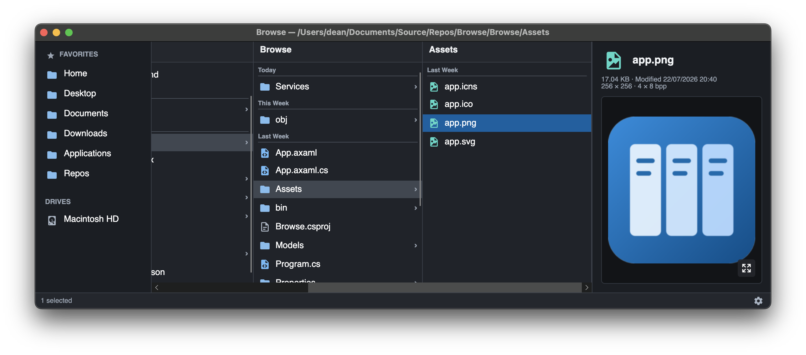

[](https://twitter.com/deanthecoder)
[](https://github.com/deanthecoder/Browse/stargazers)

# Browse

**Fast, Finder-style column browsing for Windows and macOS.**

Browse brings macOS Finder's column view to a focused, cross-platform file manager. Follow a folder hierarchy from left to right, keep the surrounding path visible, and inspect the selected item without leaving the window.

It combines that navigation model with the conveniences expected on Windows: F2 rename, UNC paths, Explorer drag-and-drop, terminal access, a global launcher, and optional File Explorer integration.



## Highlights

### Column-first navigation

- Finder-style folder columns with horizontal scrolling.
- Favorites and drives always available in the sidebar.
- Files and folders mixed together instead of separated into blocks.
- Modified-date grouping under **Today**, **Yesterday**, **This Week**, **Last Week**, **This Month**, and **Earlier**. It is enabled by default and can be toggled globally.
- Arrow-key navigation through folders, including moving above the leftmost column.
- Go directly to a local, escaped POSIX, or UNC path with `Ctrl+G` / `Command+G`.
- Live filesystem watching keeps open columns synchronized with changes made elsewhere.

### Useful previews

The Info pane gives quick, bounded previews without turning ordinary navigation into a heavyweight operation. A larger preview window is available when the format supports it.

- Images, including TIFF, plus native video thumbnails where the operating system provides them.
- PDF first-page previews.
- Plain text, Markdown, rendered HTML, JSON, XML, and source code with syntax highlighting.
- Conventional offset/hex/ASCII views for unknown binary files.
- ZIP archive contents and Windows executable metadata.
- File dimensions, size, modified time, image bit depth, and on-demand folder-size calculation.

### Real file management

- Multi-selection, copy, cut, paste, rename, and recycle-bin deletion.
- Drag files and folders within Browse or between Browse and Explorer/Finder.
- Create ZIP archives and expand them with visible progress.
- Open files with their system application or open a terminal in the containing folder.
- Copy one or more fully qualified paths, with quoting suitable for command lines.
- Advanced commands for MD5, SHA-256, and Base64 output.
- Multiple independent Browse windows, with remembered window size and last location.

### Windows integration

- Press `Ctrl+Alt+B` anywhere to open a new Browse window.
- Launch new windows and access About/Exit from the notification-area icon.
- Optionally start Browse with Windows.
- Add **Browse...** to File Explorer context menus for folders, folder backgrounds, and drives.
- Browse local drives, mapped drives, and UNC network paths.

On Windows 11, the classic registry-based **Browse...** command appears under **Show more options**.

## Designed to stay fast

Browse keeps directory snapshots briefly cached so backtracking is immediate, then invalidates active entries through filesystem watchers. Previews read bounded samples, image and video work is size-limited, and slow preview work is canceled when the selection changes. Large code, JSON, and hex previews use virtualized editors to remain responsive.

## Keyboard shortcuts

| Action | Windows | macOS |
| --- | --- | --- |
| Go to path | `Ctrl+G` | `Command+G` |
| Copy / cut / paste | `Ctrl+C/X/V` | `Command+C/X/V` |
| Enter or leave a folder | `Left` / `Right` | `Left` / `Right` |
| Move through a column | `Up` / `Down` | `Up` / `Down` |
| Rename | `F2` | `F2` |
| Open selected file | `Enter` | `Enter` |
| Open a new Browse window globally | `Ctrl+Alt+B` | — |

Typing while a column is focused jumps to matching names or file extensions—for example, typing `.exe` selects the first executable in that column.

## Download

Installers are attached to the [latest GitHub release](https://github.com/deanthecoder/Browse/releases/latest):

- **Windows:** x64 Inno Setup installer.
- **macOS:** Apple Silicon and Intel disk images.

The Windows installer offers optional startup and File Explorer context-menu integration.

## Build from source

Browse targets .NET 8 and is built with [Avalonia](https://avaloniaui.net/).

```text
git clone --recurse-submodules https://github.com/deanthecoder/Browse.git
cd Browse
dotnet build Browse.slnx
dotnet test Browse.slnx
dotnet run --project Browse/Browse.csproj
```

To create local installers:

```text
python Installer/pack.py
```

The GitHub Actions installer workflow builds the Windows and macOS packages and can publish them directly to a GitHub release.

## License

Browse is available under the [MIT License](LICENSE).
